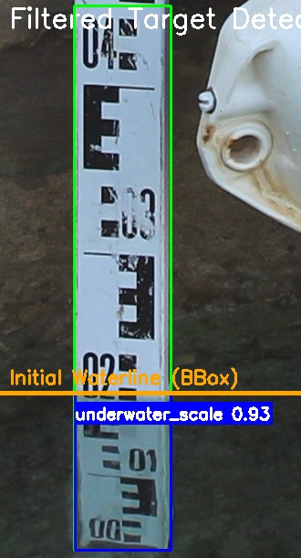
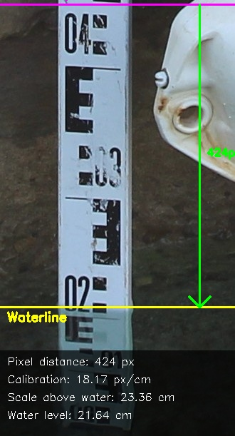
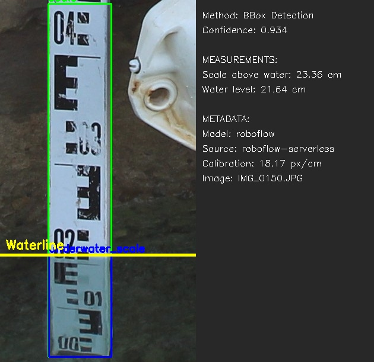

# Water Level Measurement System: Deep Learning

Automated water level detection using pretrained deep learning models (YOLO, RT-DETR) with optional SAM post-processing.

> Part of research conducted at the [SenseLAB](http://senselab.tuc.gr/) of the [Technical University of Crete](https://www.tuc.gr/el/archi).

[](https://opensource.org/licenses/BSD-3-Clause)
[](https://www.python.org/downloads/)
[](https://pytorch.org/)

## Documentation Index

### Getting Started

- [QUICKSTART.md](QUICKSTART.md) - Get running in 5 minutes
- [CALIBRATION_GUIDE.md](CALIBRATION_GUIDE.md) - Calibration instructions and best practices

## Table of Contents

- [Overview](#overview)
- [Key Features](#key-features)
- [Quick Use Guide](#quick-use-guide)
- [Installation](#installation)
- [Configuration](#configuration)
  - [Model Configuration](#model-configuration)
  - [Measurement Calibration](#measurement-calibration)
  - [SAM Post-Processing (Optional)](#sam-post-processing-optional)
  - [Debug Visualization](#debug-visualization)
- [Data Export Options](#data-export-options)
- [Project Structure](#project-structure)
- [Development](#development)
- [Troubleshooting](#troubleshooting)
- [Architecture](#architecture)
- [Dependencies](#dependencies)
- [Example Processing Workflow](#example-processing-workflow)
- [Advanced Usage](#advanced-usage)
- [License](#license)
- [Citation](#citation)
- [Support](#support)

## Overview

This system provides automated water level detection and measurement using deep learning object detection models. Designed for continuous monitoring with pretrained YOLO/RT-DETR models or Roboflow cloud inference, it processes images and stores precise measurements in a database.

Unlike traditional computer vision approaches, this system leverages deep learning for robust detection across varying lighting, weather, and water conditions.

## Key Features

Deep learning detection with YOLO/RT-DETR support, Roboflow cloud integration, optional SAM post-processing, comprehensive debug visualization, interactive runtime configuration, automated batch processing, multi-format data export, and GUI-based file selection.

## Quick Use Guide

This guide provides a step-by-step workflow for getting the system running quickly.

### Step 1: Setup and Dependencies

```bash
# Clone the repository
git clone <your-repo-url>
cd tide_reader_DL

# Create virtual environment
python -m venv .venv
.venv\Scripts\activate  # Windows
# source .venv/bin/activate  # Linux/Mac

# Install Python dependencies
pip install -r requirements.txt
```

### Step 2: Setup API Keys (If Using Roboflow)

If using Roboflow cloud models:

```bash
# Copy secrets template
cp secrets.yaml.template secrets.yaml

# Edit secrets.yaml and add your Roboflow API key
```

**Get your API key:**

1. Log in to [Roboflow](https://roboflow.com)
2. Go to Settings → API Keys
3. Copy your API key to `secrets.yaml`

### Step 3: Add Your Detection Model

Choose one of the model options:

**Option A: Local Model (YOLO/RT-DETR)**

```bash
# Place your trained model in models/detection/
cp your_model.pt models/detection/best.pt

# Update config.yaml
models:
  detection:
    type: yolo  # or rt-detr
    source: local
    local_path: models/detection/best.pt
```

**Option B: Roboflow Download**

```bash
# Model will be downloaded on first run
# Update config.yaml:
models:
  detection:
    source: roboflow
    roboflow_workspace: your-workspace
    roboflow_project: your-project
    roboflow_version: 5
```

**Option C: Roboflow Hosted Inference**

```bash
# No download required - uses cloud inference
# Update config.yaml:
models:
  detection:
    source: roboflow-serverless
    roboflow_model_id: your-project/5
```

### Step 4: Download SAM Model (Optional)

SAM post-processing is optional and disabled by default. Skip this step to use only the detection model.

```bash
cd models/segmentation

# Option 1: vit_b (358 MB) - Fastest, good quality [RECOMMENDED]
wget https://dl.fbaipublicfiles.com/segment_anything/sam_vit_b_01ec64.pth -O sam_vit_b.pth

# Update config.yaml:
# models:
#   segmentation:
#     enabled: true
#     checkpoint_type: vit_b
#     local_path: models/segmentation/sam_vit_b.pth
```

**Important:** Modern detection models (DETR/YOLO) often work well without SAM. Use the debug visualizer to compare methods before enabling SAM.

### Step 5: Run Calibration (Required)

Calibrate the pixels-per-cm ratio:

```bash
python -m src.calibration
```

A GUI file browser will open:

1. Select an image with clear above-water scale markings
2. Click two points on the scale with known distance
3. Enter the physical distance in centimeters
4. Calibration saved to `config.yaml`

See [CALIBRATION_GUIDE.md](CALIBRATION_GUIDE.md) for detailed instructions.

**Why calibration is required:** The underwater portion of the scale is optically distorted by water refraction, so we must calibrate using only the above-water portion.

### Step 6: Configure Detection Settings

Edit [config.yaml](config.yaml) to adjust:

```yaml
models:
  detection:
    confidence_threshold: 0.5  # Adjust detection sensitivity
    iou_threshold: 0.45       # Adjust overlap threshold

processing:
  target_classes:
    - waterline  # Update if your model uses different names
    - scale

output:
  csv_export: true   # Enable/disable export formats
  json_export: true
  database: true
```

### Step 7: Enable Debug Mode (Recommended for First Run)

Enable debug visualization to verify system operation:

```bash
# Windows
set DEBUG_MODE=true

# Linux/Mac
export DEBUG_MODE=true

# Or in config.yaml:
# debug:
#   enabled: true
```

### Step 8: Add Test Images

```bash
# Place test images in data/input/ directory
# Or use GUI selector in the next step
```

### Step 9: Run Water Level Detection

```bash
python src/main.py
```

**Interactive prompts:**

1. Select input directory (GUI dialog or use default)
2. Select model file (if using local model)
3. Enable/disable SAM post-processing

### Step 10: Monitor Processing

**Key log messages to watch for:**

```bash
# Successful startup
INFO - Water Level Detection System - Model-Based
INFO - Model: models/detection/best.pt
INFO - SAM enabled: False
INFO - Starting processing loop

# Detection results for each image
INFO - Processed IMG_0001.JPG: Water level = 42.30 cm, Scale above water = 15.70 cm

# Export confirmation
INFO - Exported measurements in configured formats
```

### Step 11: Review Results

Check generated output:

```bash
data/output/
├── measurements.db                    # Main SQLite database
├── measurements_YYYYMMDD_HHMMSS.csv  # CSV export (if enabled)
├── measurements_YYYYMMDD_HHMMSS.json # JSON export (if enabled)
└── annotated/                         # Visual output images
    └── IMG_0001_annotated.jpg        # Annotated with bounding boxes and measurements
```

**Debug images** (if debug mode enabled):

```bash
data/debug/session_YYYYMMDD_HHMMSS/
├── 01_original.jpg                   # Original input image
├── 02_all_detections.jpg            # All model detections
├── 03_filtered_detections.jpg       # Filtered target classes
├── 07_measurements.jpg              # Measurement breakdown
└── 08_final_result.jpg              # Final annotated result
```

**What to check:**

- Bounding boxes are correctly detecting waterline and scale
- Measurements are accurate compared to actual water level
- Confidence scores are reasonable (>0.5 typically)

## Common Troubleshooting

- **No detections found:** Adjust `confidence_threshold` in config.yaml (try 0.3)
- **Wrong measurements:** Re-run calibration with clear above-water reference
- **Model not loading:** Check model path and ensure file exists
- **Roboflow errors:** Verify API key in secrets.yaml

> **Note:** This guide covers the essential workflow from setup to measurement results. For detailed configuration options, see the full documentation sections below.

## Installation

### Prerequisites

- **Python 3.9+** with pip
- **CUDA Toolkit** (optional, for GPU acceleration)
- **Git** for cloning repository

### System Dependencies

The system requires several Python packages for deep learning and image processing:

```bash
# Core deep learning dependencies
pip install torch torchvision  # PyTorch (CPU or GPU version)
pip install ultralytics         # YOLO/RT-DETR models
pip install segment-anything    # SAM (optional)

# Roboflow integration (optional)
pip install roboflow           # Roboflow Python SDK
pip install inference-sdk      # Roboflow serverless API

# Computer vision and data processing
pip install opencv-python numpy supervision
pip install PyYAML pandas python-dotenv
```

Or simply:

```bash
pip install -r requirements.txt
```

### GPU Support (Optional)

For faster inference with GPU acceleration:

```bash
# Install PyTorch with CUDA support
# Visit https://pytorch.org/get-started/locally/ for your system
pip install torch torchvision --index-url https://download.pytorch.org/whl/cu118
```

## Configuration

### Model Configuration

The system expects your model to detect these classes:

- `waterline`: The water level line
- `scale`: The measurement scale
- `marker` (optional): Scale markers for calibration

**Update target classes** in [config.yaml](config.yaml) if your model uses different class names:

```yaml
processing:
  target_classes:
    - water_level      # Instead of 'waterline'
    - ruler            # Instead of 'scale'
```

### Measurement Calibration

**Auto-calibration**: If your model detects the scale, the system automatically calculates pixels-to-cm ratio.

**Manual calibration**: Set `pixels_per_cm` in [config.yaml](config.yaml) if you know the conversion factor.

**Calibration workflow:**

```bash
python -m src.calibration
```

See [CALIBRATION_GUIDE.md](CALIBRATION_GUIDE.md) for detailed instructions and best practices.

### SAM Post-Processing (Optional)

SAM provides segmentation-based waterline refinement that can improve accuracy in some scenarios:

- Precise scale boundary segmentation
- Underwater scale masking
- Color-based waterline detection

**Important:** Modern detection models (DETR/YOLO) often provide accurate waterline detection without SAM. We recommend enabling debug mode to visually compare bbox vs SAM waterline before relying on SAM refinement. In some cases, the detection model alone may be more accurate.

**Download SAM Model:**

```bash
cd models/segmentation

# Choose ONE of these models:

# Option 1: vit_b (358 MB) - Fastest, good quality [RECOMMENDED]
wget https://dl.fbaipublicfiles.com/segment_anything/sam_vit_b_01ec64.pth -O sam_vit_b.pth

# Option 2: vit_l (1.2 GB) - Balanced
wget https://dl.fbaipublicfiles.com/segment_anything/sam_vit_l_0b3195.pth -O sam_vit_l.pth

# Option 3: vit_h (2.4 GB) - Best quality, slowest
wget https://dl.fbaipublicfiles.com/segment_anything/sam_vit_h_4b8939.pth -O sam_vit_h.pth
```

**Enable SAM in config.yaml:**

```yaml
segmentation:
  enabled: true
  checkpoint_type: vit_b  # or vit_l, vit_h
  local_path: models/segmentation/sam_vit_b.pth
```

**SAM Waterline Refinement Process:**

1. **Scale Segmentation**: Uses the detected scale bounding box as a prompt for SAM
2. **Color Analysis**: Analyzes HSV color space to detect underwater region
   - Underwater scales typically show color/hue differences due to water
   - Uses saturation gradient to find the transition point
3. **Boundary Extraction**: Identifies the top boundary of the underwater region
4. **Refined Waterline**: Uses this boundary as the precise waterline position

SAM refinement may improve accuracy in specific scenarios:

- The waterline detection bbox is imprecise or inconsistent
- The scale shows clear color differentiation underwater
- The scale has complex geometry that benefits from segmentation

**Note:** Use the debug visualizer to compare both methods with your specific images before enabling SAM.

For more details, see [models/README.md](models/README.md).

### Debug Visualization

The system includes a comprehensive debug visualizer that saves step-by-step images of the detection pipeline.

**Enable debug mode:**

```bash
# Via environment variable
export DEBUG_MODE=true  # Linux/Mac
set DEBUG_MODE=true     # Windows

# Or in config.yaml:
debug:
  enabled: true
  save_intermediate_steps: true
  output_dir: data/debug
```

**Debug output includes:**

- Original image with metadata
- All model detections before filtering
- Filtered target detections with initial waterline
- SAM full scale segmentation (when SAM enabled)
- SAM underwater mask with refined waterline (when SAM enabled)
- Waterline comparison: bbox vs SAM (when SAM enabled)
- Measurement breakdown with annotations
- Final result with metadata panel

Debug sessions are saved to timestamped directories: `data/debug/session_YYYYMMDD_HHMMSS/`

**Use cases:**

- Compare bbox vs SAM waterline detection methods
- Verify detection accuracy and confidence scores
- Troubleshoot detection failures
- Analyze measurement calculations
- Optimize confidence thresholds

## Data Export Options

The system automatically exports measurement data in multiple formats based on your [config.yaml](config.yaml) settings. All exports are created in the `data/output/` directory with timestamped filenames to prevent overwrites.

### Export Configuration

```yaml
output:
  csv_export: true      # Export to CSV format
  json_export: true     # Export to JSON format
  database: true        # Create database backups
```

### Export Formats

**CSV Export (`csv_export: true`)**

- Creates `measurements_YYYYMMDD_HHMMSS.csv` files
- Includes all measurement data in tabular format
- Columns: timestamp, water_level_cm, scale_above_water_cm, image_path, confidence, detection_method
- Compatible with Excel, pandas, data analysis tools
- Best for: Spreadsheet analysis, reporting, graphs, time series plotting

**JSON Export (`json_export: true`)**

- Creates `measurements_YYYYMMDD_HHMMSS.json` files
- Structured data with proper type handling
- Includes all metadata (timestamp, measurements, confidence, method)
- Easy parsing for web applications, APIs, custom analysis
- Best for: Integration with other systems, REST APIs, custom processing

**Database (`database: true`)**

- Main database: `measurements.db` (always present)
- Backup files: `measurements_YYYYMMDD_HHMMSS.db`
- Complete SQLite database copies with all measurements
- Preserves all data including processing metadata
- Best for: Data archiving, system recovery, SQL queries

**Annotated Images (always created)**

- Saved in `data/output/annotated/`
- Shows bounding boxes, waterline marker, and measurements
- Filename: `{original_name}_annotated.jpg`
- Useful for visual verification and reporting

### Export Behavior

Exports occur automatically:

- After processing each batch of images
- With timestamped filenames to prevent overwrites
- Only for enabled formats (set to `false` to disable)
- With error handling (failures logged but don't stop processing)

**Example Output:**

```txt
data/output/
├── measurements.db                         # Main database (always present)
├── measurements_20250826_143022.csv       # CSV export (if enabled)
├── measurements_20250826_143022.json      # JSON export (if enabled)
├── measurements_20250826_143022.db        # Database backup (if enabled)
└── annotated/
    ├── IMG_0001_annotated.jpg             # Annotated images
    └── IMG_0002_annotated.jpg
```

### Disable Exports

Set any format to `false` to disable:

```yaml
output:
  csv_export: false     # No CSV files created
  json_export: false    # No JSON files created
  database: false       # No database backups
```

**Note:** The main `measurements.db` database is always created regardless of export settings.

## Project Structure

```txt
tide_reader_DL/
├── config.yaml              # Main configuration
├── secrets.yaml            # API keys (create from template)
├── requirements.txt        # Python dependencies
├── README.md               # This file
├── QUICKSTART.md           # 5-minute quick start guide
├── CALIBRATION_GUIDE.md    # Calibration instructions
├── src/
│   ├── main.py            # Main entry point
│   ├── detector.py        # Water level detection logic
│   ├── model_loader.py    # Model loading (local/Roboflow)
│   ├── database.py        # Database operations
│   ├── calibration.py     # Calibration management
│   ├── debug_visualizer.py # Debug image generation
│   └── utils.py           # Utility functions
├── models/
│   ├── detection/         # Place YOLO/RT-DETR models here
│   │   └── best.pt        # Your trained detection model
│   └── segmentation/      # Place SAM checkpoints here
│       └── sam_vit_b.pth  # SAM model (optional)
├── docs/                  # Additional documentation/notes 
├── demo/
│   └── images/            # Example processing images
└── data/
    ├── input/             # Input images
    ├── processed/         # Processed images
    ├── calibration/       # Calibration data
    ├── output/            # Results (CSV, JSON, DB, annotated images)
    └── debug/             # Debug images (when enabled)
```

## Development

### Setting Up Development Environment

1. **Clone repository:**

```bash
git clone <repo-url>
cd tide_reader_DL
```

2. **Create virtual environment:**

```bash
python -m venv .venv
.venv\Scripts\activate  # Windows
# source .venv/bin/activate  # Linux/Mac
```

3. **Install dependencies:**

```bash
pip install -r requirements.txt
```

4. **Setup development environment:**

```bash
# Copy configuration templates
cp secrets.yaml.template secrets.yaml

# Create data directories
mkdir -p data/{input,processed,calibration,output,debug}
```

### Running Tests

```bash
# 1. Test calibration module
python -m src.calibration

# 2. Test with debug logging
python src/main.py
# Check logs in logs/water_level.log

# 3. Test GUI interface
set USE_GUI_SELECTOR=true
python src/main.py

# 4. Test Roboflow integration
# Edit secrets.yaml with API key
python src/main.py
```

### Development Best Practices

- **Use debug mode** during development: `set DEBUG_MODE=true`
- **Check logs** in `logs/water_level.log` for detailed information
- **Test with small batches** before processing large image sets
- **Verify calibration** accuracy before production use
- **Monitor confidence scores** to optimize thresholds

## Troubleshooting

### Common Issues

**"System not calibrated" error:**

- Ensure calibration file exists: check `config.yaml` for `pixels_per_cm` value
- Run calibration: `python -m src.calibration`
- Verify calibration image has clear above-water scale markings

**No detections found:**

- Lower confidence threshold in config.yaml: `confidence_threshold: 0.3`
- Check model is detecting correct classes: enable debug mode
- Verify image quality and scale visibility
- Ensure target_classes in config match your model's output

**Wrong measurements:**

- Re-run calibration with clearer above-water reference image
- Verify pixels_per_cm value in config.yaml is reasonable
- Check that scale is fully visible in images
- Enable debug mode to inspect detection bounding boxes

**SAM not working:**

- Verify SAM model file exists in `models/segmentation/`
- Check SAM is enabled in config.yaml: `segmentation.enabled: true`
- Ensure correct checkpoint_type matches downloaded model
- SAM requires GPU or runs slowly on CPU

**Roboflow connection errors:**

- Verify API key in secrets.yaml is correct
- Check internet connection
- Verify workspace/project/version in config.yaml
- Check Roboflow API quotas

**Model not loading:**

- Check model path in config.yaml matches actual file location
- Ensure model file is valid PyTorch .pt file
- For Roboflow: verify workspace/project/version are correct
- Check logs for detailed error messages

**No images being processed:**

- Verify images are in input directory
- Check database path is writable
- Clear processed image tracking: delete `data/output/measurements.db`
- Verify image file extensions are supported (.jpg, .jpeg, .png)

### Debug Mode

Enable detailed logging:

```bash
# Environment variable (recommended)
set DEBUG_MODE=true

# Or in config.yaml:
debug:
  enabled: true
```

View logs:

```bash
# Windows
type logs\water_level.log

# Linux/Mac
tail -f logs/water_level.log
```

### Getting Help

1. Check [QUICKSTART.md](QUICKSTART.md) for setup guide
2. Review [CALIBRATION_GUIDE.md](CALIBRATION_GUIDE.md) for calibration issues
3. Enable debug mode and inspect generated images

## Architecture

```txt
┌─────────────────────┐
│   User Input        │
│  (Images/Config)    │
└──────────┬──────────┘
           │
           ▼
┌─────────────────────┐
│   Main Application  │
│    (src/main.py)    │
└──────────┬──────────┘
           │
           ▼
┌─────────────────────┐    ┌──────────────────┐     ┌─────────────────┐
│   Model Loader      │───▶│  Calibration     │───▶│  Database       │
│ (Local/Roboflow)    │    │  Manager         │     │  Manager        │
└──────────┬──────────┘    └──────────────────┘     └────────┬────────┘
           │                                                 │
           ▼                                                 │
┌─────────────────────┐                                      │
│  Detection Model    │                                      │
│  (YOLO/RT-DETR)     │                                      │
└──────────┬──────────┘                                      │
           │                                                 │
           ▼                                                 │
┌─────────────────────┐    ┌──────────────────┐              │
│  Water Level        │───▶│  SAM Refinement  │              │
│  Detector           │    │  (Optional)      │              │
└──────────┬──────────┘    └──────────────────┘              │
           │                                                 │
           ▼                                                 │
┌─────────────────────┐                                      │
│  Debug Visualizer   │                                      │
│  (Optional)         │                                      │
└──────────┬──────────┘                                      │
           │                                                 │
           ▼                                                 ▼
┌─────────────────────────────────────────────────────────────┐
│                     Output                                  │
│  • Annotated Images  • CSV Export  • JSON Export  • Database│
└─────────────────────────────────────────────────────────────┘
```

**Processing Flow:**

1. **Input**: User provides images and configuration
2. **Model Loading**: System loads detection model (local or Roboflow) and optional SAM model
3. **Calibration**: Applies pixels-per-cm conversion factor
4. **Detection**: Model detects waterline and scale in images
5. **Optional SAM Refinement**: Refines waterline using segmentation
6. **Measurement**: Calculates water level from pixel coordinates
7. **Debug Visualization**: Generates step-by-step debug images (if enabled)
8. **Storage**: Saves measurements to database
9. **Export**: Exports data in configured formats (CSV/JSON/DB)
10. **Output**: Creates annotated images with bounding boxes and measurements

## Dependencies

### Core Requirements

- Python 3.9+
- PyTorch 2.0+
- Ultralytics (YOLO/RT-DETR)
- OpenCV, NumPy, pandas

### Optional Dependencies

- Segment Anything (SAM post-processing)
- Roboflow SDK (cloud model integration)
- inference-sdk (Roboflow serverless API)
- CUDA Toolkit (GPU acceleration)

### Complete Dependency List

See [requirements.txt](requirements.txt) for exact versions.

## Example Processing Workflow

The system processes images through a multi-stage pipeline, producing detailed visualizations at each step:

### Detection Pipeline

#### 1. Object Detection



The model detects the scale and waterline, filtering target classes and computing the initial waterline position.

#### 2. Measurement Calculation



Using calibration data, the system calculates:

- Pixel distance from scale top to waterline
- Scale above water (cm)
- Water level (cm)

#### 3. Final Annotated Result



Complete output with bounding boxes, waterline marker, measurements, and metadata panel showing detection method, confidence, and calibration info.

## Advanced Usage

### Environment Variables

```bash
# Processing configuration
USE_GUI_SELECTOR=true       # Enable GUI directory selection
DEBUG_MODE=true            # Enable debug visualization
PROCESS_INTERVAL=60        # Processing interval in seconds
DB_PATH=./data/output/measurements.db  # Database path
```

### Custom Detection Classes

If your model uses different class names:

```yaml
processing:
  target_classes:
    - water_level      # Instead of 'waterline'
    - ruler            # Instead of 'scale'
```

### Batch Processing

Process multiple directories:

```bash
# Process each directory
for dir in data/batch1 data/batch2 data/batch3; do
    python src/main.py --input-dir $dir
done
```

### Training Your Own Model

To train a custom detection model:

1. Collect images of your scale setup
2. Annotate with waterline and scale bounding boxes
3. Train YOLO/RT-DETR model using Ultralytics or Roboflow
4. Export model to .pt format
5. Place in `models/detection/` and update config.yaml

## License

This project is licensed under the BSD 3-Clause License. See [LICENSE](LICENSE) file for details.

## Support

For issues or questions:

1. Check [Troubleshooting](#troubleshooting) section
2. Review [QUICKSTART.md](QUICKSTART.md) for quick start guide
3. Check [CALIBRATION_GUIDE.md](CALIBRATION_GUIDE.md) for calibration help
4. Check [config.yaml](config.yaml) comments for configuration options
5. Enable debug mode and inspect generated images
6. Check model compatibility and confidence thresholds
